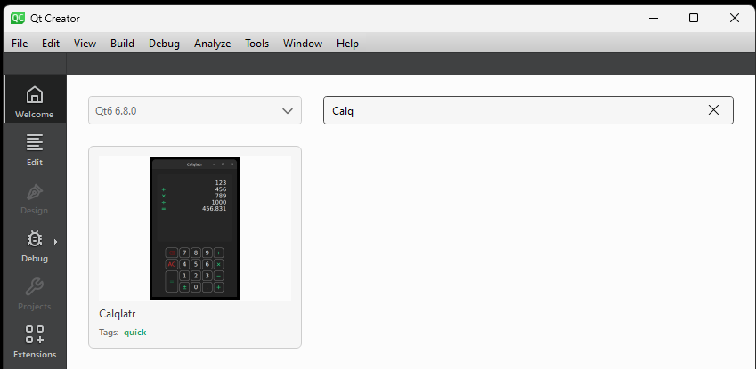
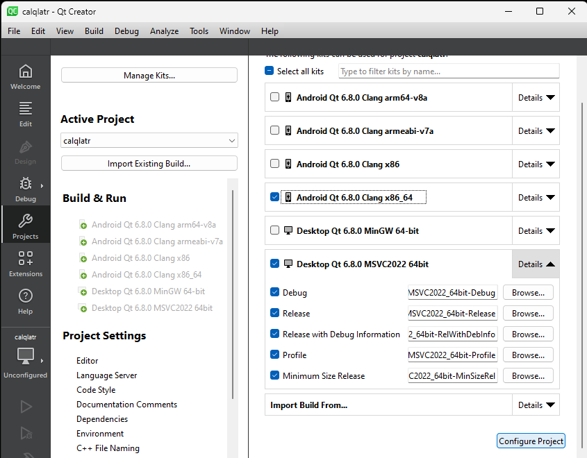
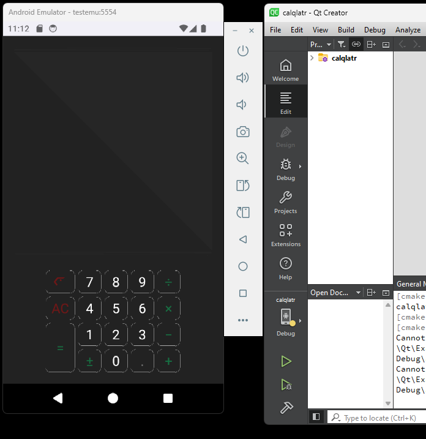

# Open Qt Example Calqlatr
Qt Creator ships with many example projects. A good example project to test that the system can successfully compile and deploy Android applications is the Calqlatr example.  It creates a simple calculator app, perfect for running on a phone or tablet.

Start Qt Creator and on the Welcome screen, search for Calqlatr and open it.

# Configure project to build for Android
After the example project opens, you will see a screen where you can configure the project. By default the Desktop version is already configured, targeting your Windows desktop.  We need to enable one or more Android targets.  For the emulator, we need to check the box next to "Android Qt 6.8.0 Clang x86_64."  If you wish to run the app on a real Android device you also need to check the box next to the appropriate Android platform type.  For most phones and tablets these days that is arm64-v7a.  But older devices require armeaba-v7a.  Click on the "Configure" button to activate these configurations.

The current build target is set by clicking on the icon above the run and debug icons on the left column.  You can select the Kit, Build, and target device, which will be the emulator set up previously, or a real phone or tablet that's currently attached to USB.

To deploy and run or debug the app, use the normal Qt Creator buttons.  If the target is the emulator, the emulator will start up automatically.  The build system will automatically deploy the apk to the device and start it running.  If you clicked on debug you can debug the app while it's running on the device.  

