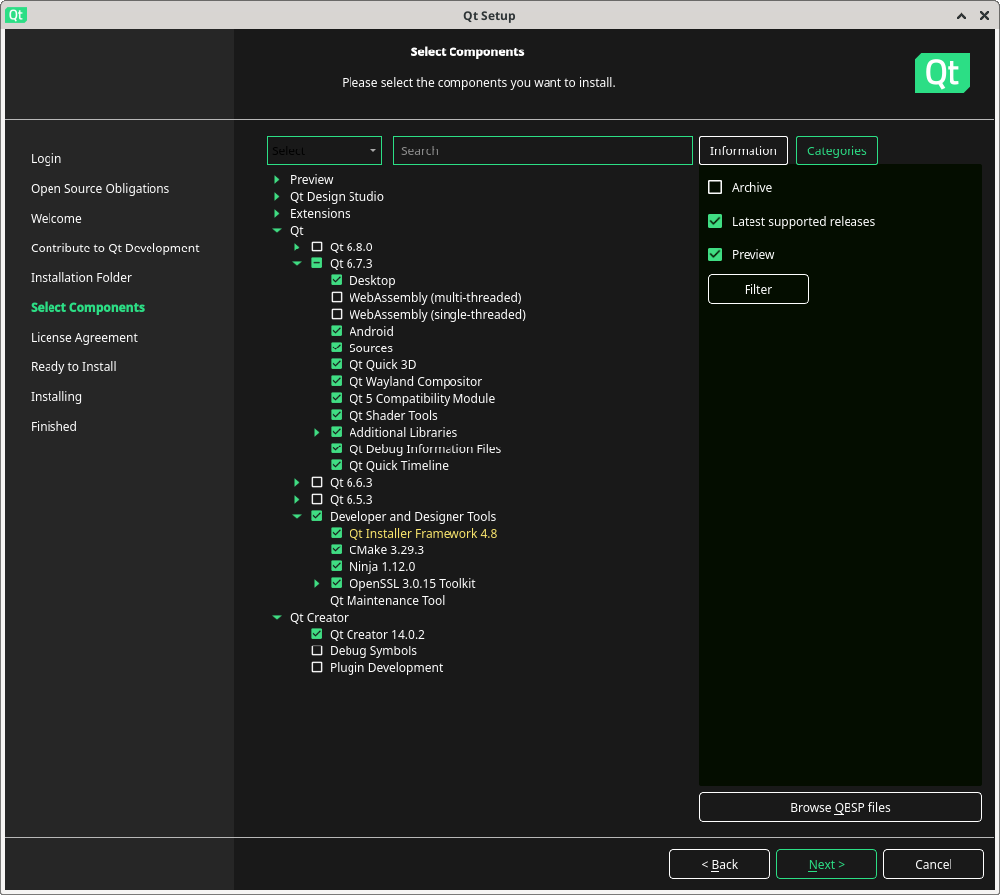
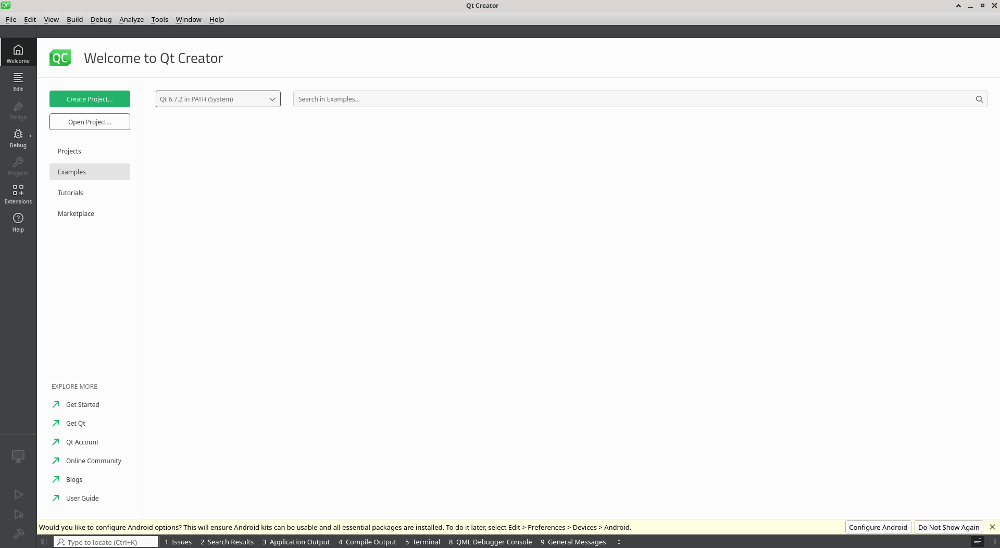
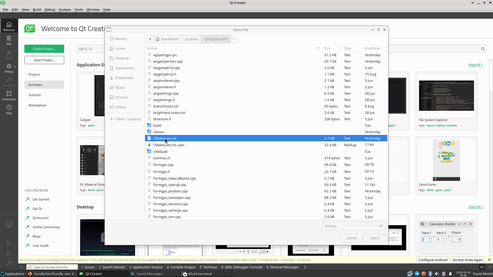

# Installing Qt and Building QtAgOpenGPS
This was done on Fedora 40, but it should work on any linux distro

## Preparing Before the Plunge
Some dependencies

If the commands listed below don't work, have a look at <br>
https://doc.qt.io/qt-6/linux.html<br>
Note changes from yum to dnf on the Fedora section
### Fedora
```
sudo dnf groupinstall "C Development Tools and Libraries"
sudo dnf install mesa-libGL-devel
sudo dnf install xcb-util-cursor xcb-util-cursor-devel
```
### Apt Based Distros(Ubuntu,Debian,Mint)

```
sudo apt-get install build-essential libgl1-mesa-dev
```

## Download and Install Qt
### Download The Qt Installer

Start here: https://www.qt.io/download-open-source <br>
Note that you might have to sign in(create an account if necessary).

Scroll down to the bottom and click the "Download the Qt Online Installer" link. (Why can't this be a giant Download button, Qt???)<br>
 Select your OS.
### Run It
 This differs between OS's, on Linux:


Start running through the installer(You'll have to sign into your Qt Account). <br>

When you get to this page:

Select Custom Installation,<br>
Select the ojects shown below. You don't need anything in Preview, Qt Design Studio, or Extensions.<br>
I suppose one could use 6.8.0, but 6.7.3 has been proven to work. <br>

If you don't plan to build for Android, you don't need to select it.

Very likely, not all of these are needed. It's just easier to install all of them, then to miss one, and have to re-run the installer.


Finish the installer and Download. It will take awhile to download and install.

Click "Open QtCreator" once the installer is done. 

Notice in the top right, the version "6.7.2 in PATH" is selected. If you have never done anything Qt related before, you won't need to do anything, but I had to change from the "PATH" version to the installed version. (See next screenshot)

## Clone QtAgOpenGPS

In the terminal:
### Install Git
#### Fedora
```
sudo dnf install git
```
#### Ubuntu
```
sudo apt install git
``` 

### Clone
```
mkdir ~/projects && cd ~/projects
git clone https://github.com/davidwedel/QtAgOpenGPS.git
cd QtAgOpenGPS
git checkout dev
```
#### Note: 
This uses David's personal fork right now. Torriem's repo has not yet been updated to use CMake, and these instructions are concerned with CMake only. This is also why it is necessary to switch to the dev branch. If you plan to use this in the field, then switch to the v5fixes branch by
```
git checkout v5fixes_donot_merge
```

## Open QtAgOpenGPS in QtCreator (Finally)

### Back in QtCreator:

Click "Open Project"

Navigate to the QtAgOpenGPS directory, and select the CMakeLists.txt file.


Click "Open"

You'll get a page like this:


Note that the "Desktop" is the Fedora PATH version. You likely won't have it. Deselect it if you do.
"Select Desktop Qt 6.7.3"<br>
Click "Configure Project"

## Run!

Click the "Run" button (the "play" button on the left-hand side). Will take a bit to compile.

Note that you'll have a few warnings. They should just warn, and not actually quit the compilation process.

## And it works!


